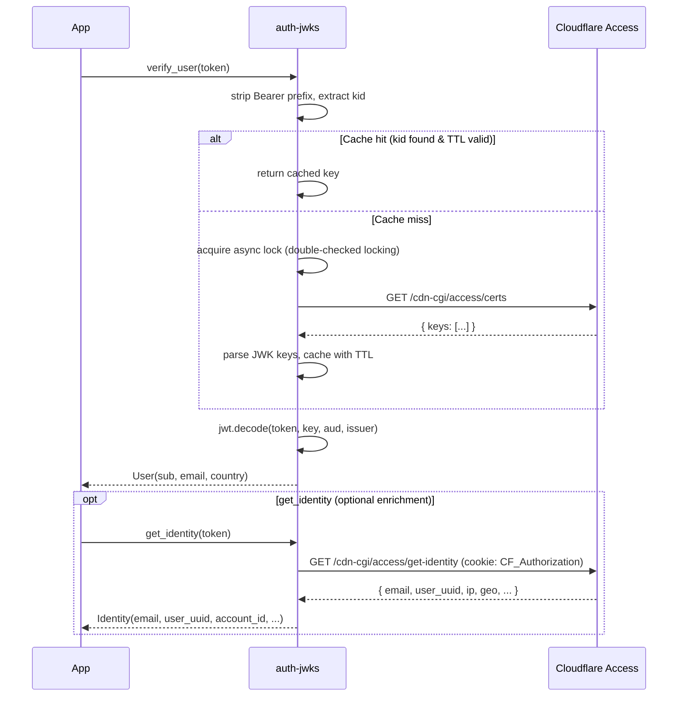

```mermaid
sequenceDiagram
    participant App
    participant auth-jwks
    participant CF as Cloudflare Access

    App->>auth-jwks: verify_user(token)
    auth-jwks->>auth-jwks: strip Bearer prefix, extract kid

    alt Cache hit (kid found & TTL valid)
        auth-jwks->>auth-jwks: return cached key
    else Cache miss
        auth-jwks->>auth-jwks: acquire async lock (double-checked locking)
        auth-jwks->>CF: GET /cdn-cgi/access/certs
        CF-->>auth-jwks: { keys: [...] }
        auth-jwks->>auth-jwks: parse JWK keys, cache with TTL
    end

    auth-jwks->>auth-jwks: jwt.decode(token, key, aud, issuer)
    auth-jwks-->>App: User(sub, email, country)

    opt get_identity (optional enrichment)
        App->>auth-jwks: get_identity(token)
        auth-jwks->>CF: GET /cdn-cgi/access/get-identity (cookie: CF_Authorization)
        CF-->>auth-jwks: { email, user_uuid, ip, geo, ... }
        auth-jwks-->>App: Identity(email, user_uuid, account_id, ...)
    end
```
