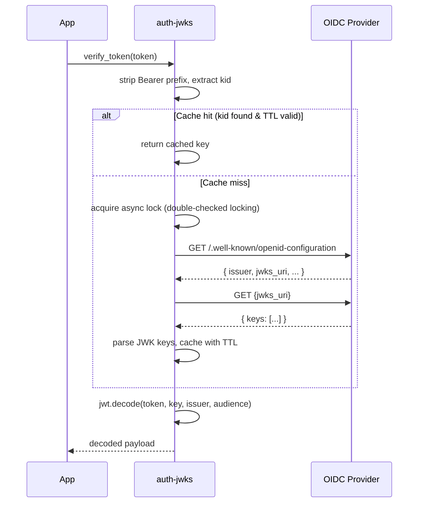

```mermaid
sequenceDiagram
    participant App
    participant auth-jwks
    participant OIDC as OIDC Provider

    App->>auth-jwks: verify_token(token)
    auth-jwks->>auth-jwks: strip Bearer prefix, extract kid

    alt Cache hit (kid found & TTL valid)
        auth-jwks->>auth-jwks: return cached key
    else Cache miss
        auth-jwks->>auth-jwks: acquire async lock (double-checked locking)
        auth-jwks->>OIDC: GET /.well-known/openid-configuration
        OIDC-->>auth-jwks: { issuer, jwks_uri, ... }
        auth-jwks->>OIDC: GET {jwks_uri}
        OIDC-->>auth-jwks: { keys: [...] }
        auth-jwks->>auth-jwks: parse JWK keys, cache with TTL
    end

    auth-jwks->>auth-jwks: jwt.decode(token, key, issuer, audience)
    auth-jwks-->>App: decoded payload
```
