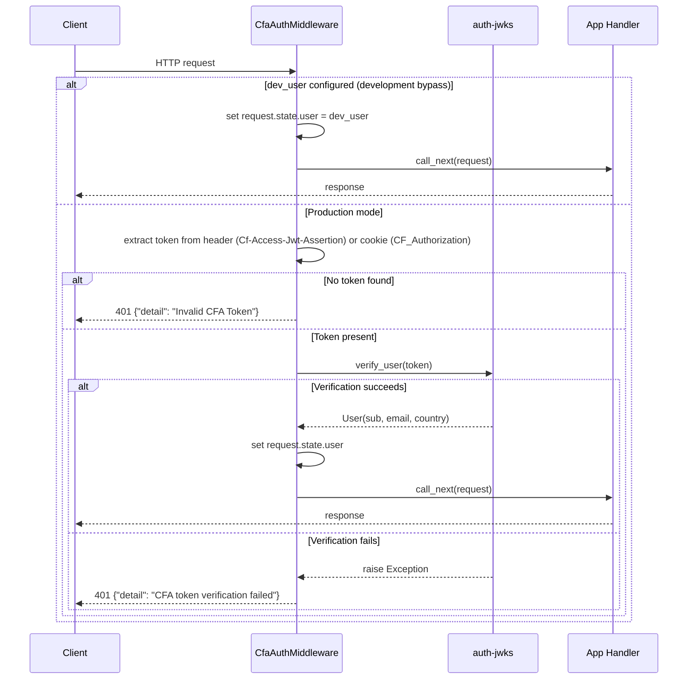

```mermaid
sequenceDiagram
    participant Client
    participant MW as CfaAuthMiddleware
    participant auth-jwks
    participant App as App Handler

    Client->>MW: HTTP request

    alt dev_user configured (development bypass)
        MW->>MW: set request.state.user = dev_user
        MW->>App: call_next(request)
        App-->>Client: response
    else Production mode
        MW->>MW: extract token from header (Cf-Access-Jwt-Assertion) or cookie (CF_Authorization)

        alt No token found
            MW-->>Client: 401 {"detail": "Invalid CFA Token"}
        else Token present
            MW->>auth-jwks: verify_user(token)

            alt Verification succeeds
                auth-jwks-->>MW: User(sub, email, country)
                MW->>MW: set request.state.user
                MW->>App: call_next(request)
                App-->>Client: response
            else Verification fails
                auth-jwks-->>MW: raise Exception
                MW-->>Client: 401 {"detail": "CFA token verification failed"}
            end
        end
    end
```
